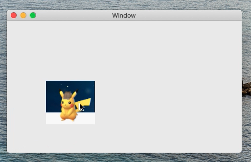

# DragAndDrop_InView
This is a minimum sample code to drag and drop an image in NSView object in macOS.

[movie in YouTube](https://youtu.be/VgjOwfBT-NU)

macOS Catalina 10.15.2  
Swift 5.1.3  
Xcode 11.3.1 
